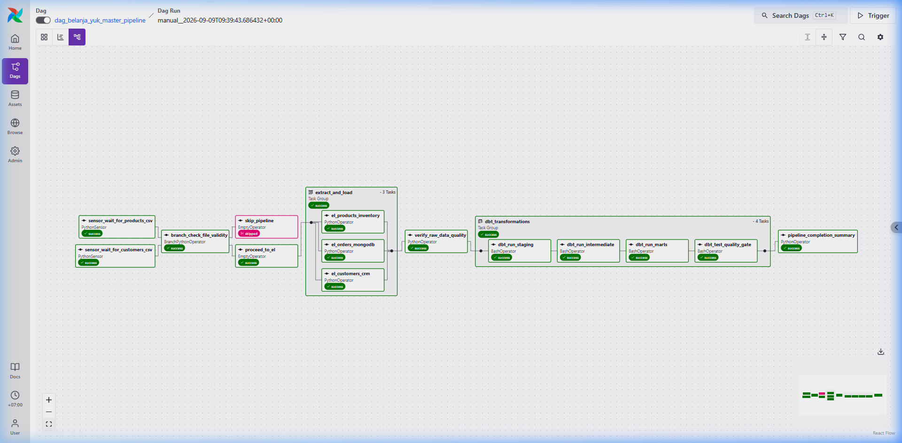
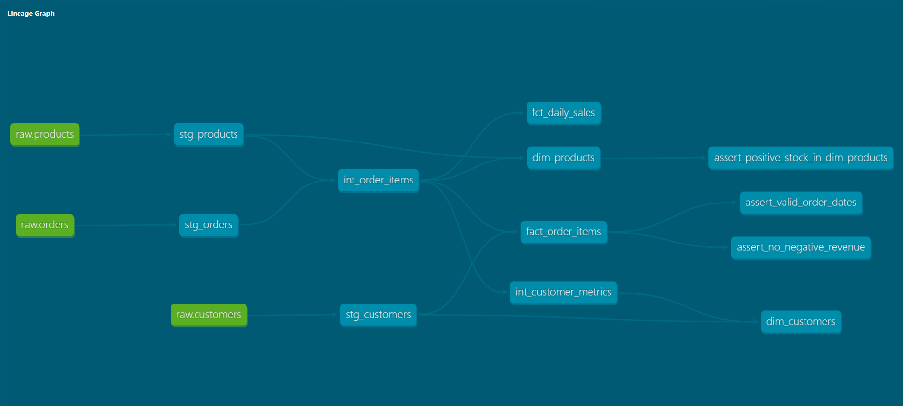
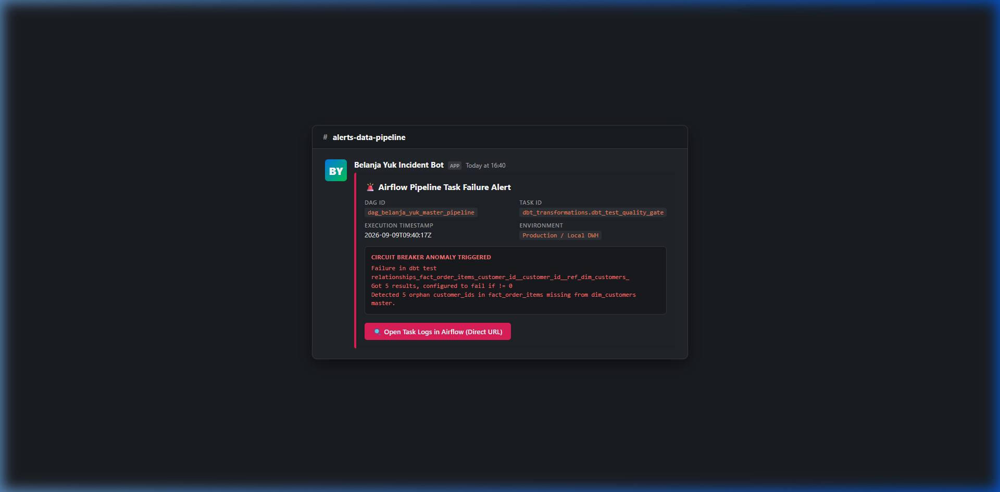
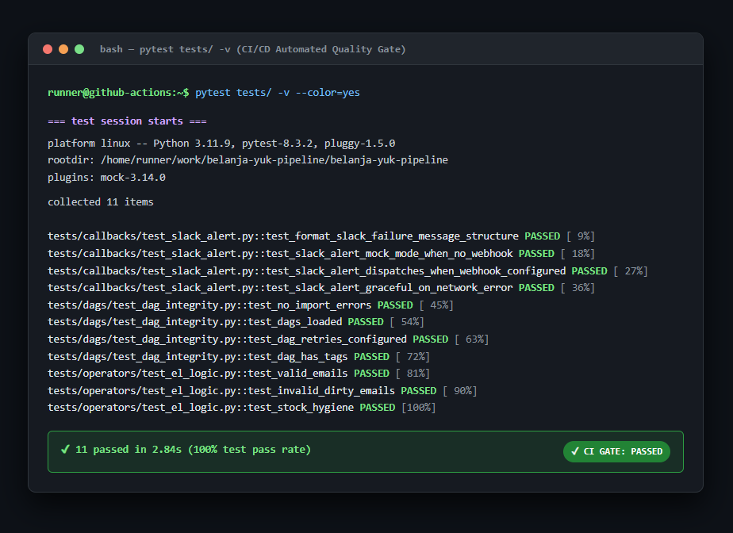

# Belanja Yuk Data Pipeline

[](https://github.com/MaleakhiNymmo/belanja-yuk-data-pipeline/actions/workflows/ci.yml)
[](https://airflow.apache.org/)
[](https://www.astronomer.io/)
[](https://www.getdbt.com/)
[](https://www.postgresql.org/)
[](https://www.mongodb.com/)
[](https://www.python.org/)

[English](README.md) | [Bahasa Indonesia](README_ID.md)

---

An end-to-end ELT data pipeline for a simulated e-commerce platform ("Belanja Yuk"). The system extracts transaction records from MongoDB and master batches from CSV files, loads them into a PostgreSQL data warehouse landing zone, transforms them into dimensional marts with dbt Core, and enforces data quality checks at runtime using Apache Airflow 3 orchestration and GitHub Actions CI/CD.

```
                      +-------------------+
                      | Source Systems    |
                      | - MongoDB (Orders)|
                      | - CSVs (CRM/Stock)|
                      +---------+---------+
                                |
                                v
               +----------------------------------+
               | Ingestion & Pre-flight Checks    |
               | - PythonSensors (file arrival)   |
               | - Branching (0-byte file check)  |
               | - Airflow 3 TaskGroup (Extract)  |
               +----------------+-----------------+
                                |
                                v
               +----------------------------------+
               | PostgreSQL DWH: raw layer        |
               | - raw.customers                  |
               | - raw.products                   |
               | - raw.orders (JSONB schema-read) |
               +----------------+-----------------+
                                |
                                v
               +----------------------------------+
               | dbt Transformation Pipeline      |
               | - staging (dedup, regex hygiene) |
               | - intermediate (JSONB unnest)    |
               | - marts (Kimball Unknown Member) |
               +----------------+-----------------+
                                |
                                v
               +----------------------------------+
               | Quality Gate & Circuit Breaker   |
               | - 19 dbt data tests in DAG       |
               | - Slack webhook on failure       |
               +----------------------------------+
```

### Master pipeline execution (Airflow 3 UI)



---

## Business context and problem statement

Belanja Yuk operates three distinct transactional systems:
1. **CRM system:** Daily exports of customer demographics and membership tiers (`customers_YYYYMMDD.csv`).
2. **Inventory system:** Daily catalog dumps containing product pricing and stock balances (`products_YYYYMMDD.csv`).
3. **Store application backend:** High-throughput transactional orders persisted in MongoDB document collections.

Before this pipeline, analytical queries required manual CSV merging and script-based JSON flattening. This operational pattern led to three main problems:
- **Revenue discrepancies:** Upstream orders from non-member checkouts were dropped when joined against CRM exports, undercounting total sales.
- **Silent pipeline failures:** Upstream schemas changed or contained malformed rows (for example invalid email formats, duplicate primary keys, zero-priced products) that entered analytics dashboards undetected.
- **Zero orchestration visibility:** Failures were discovered only after business stakeholders reported broken dashboards.

---

## Architectural decisions and engineering trade-offs

Detailed architectural decision records (ADRs) are documented in [ARCHITECTURE.md](ARCHITECTURE.md) and [PORTFOLIO_CASE_STUDY.md](PORTFOLIO_CASE_STUDY.md). Below is a summary of the core technical decisions.

### 1. Kimball Unknown Member pattern for orphan foreign keys

**Context:** The MongoDB order stream contained valid transactions completed by unregistered guests or offline POS terminals whose `customer_id` did not exist in the CRM master table.

**Trade-offs considered:**
- *Drop orphan rows:* Discarding orders causes immediate financial discrepancies between the data warehouse and general ledger.
- *Generate dummy dimension rows dynamically:* Inserting auto-generated customers into `dim_customers` inflates customer count, creates ghost entities, and risks race conditions on concurrent DAG runs.

**Adopted solution:**
- Provisioned a permanent unknown member record in `dim_customers` with `customer_id = 'UNKNOWN'` and explicit audit flags (`is_registered_in_crm = FALSE`).
- In `fact_order_items`, orphan transactions map their dimension foreign key to `'UNKNOWN'` while preserving the source value in `raw_customer_id`.
- Added a boolean column `is_registered_customer` to allow analysts to filter or group transactions by guest versus member behavior.
- Result: 100% of revenue is retained, inner joins do not drop records, and dimension cardinality remains clean.

### 2. Native JSONB schema-on-read in the raw layer

**Context:** Order documents in MongoDB include a nested array of purchased items (`items: [{ product_id, quantity, unit_price }]`).

**Adopted solution:**
- The Airflow extraction task loads order records into PostgreSQL `raw.orders` preserving the raw payload structure, storing the array directly in a native `JSONB` column.
- Unnesting and field extraction are delegated to dbt using `jsonb_to_recordset()` inside the `int_order_items` intermediate model.
- Trade-off: Shifts compute overhead from the Python worker to the database engine, preserves source data fidelity for reprocessing, and keeps ingestion code minimal.

### 3. In-DAG dbt circuit breaker

**Context:** Running dbt tests only in manual terminal sessions or separate post-deployment jobs allows bad data to linger in production tables.

**Adopted solution:**
- Transformation tasks in Airflow are split into four sequential steps within a TaskGroup:
  `dbt_run_staging` -> `dbt_run_intermediate` -> `dbt_run_marts` -> `dbt_test_quality_gate`.
- If any of the 19 dbt data tests fail (such as negative prices or broken relationships), the `dbt_test_quality_gate` task halts execution and triggers the failure callback, stopping data propagation before downstream consumption.

### 4. Alerting with graceful mock fallback

**Context:** In production, failed runs must notify on-call engineers immediately. In local development or isolated testing environments, external webhook dependencies should not cause DAG import errors or unhandled exceptions.

**Adopted solution:**
- Built an `on_failure_callback` using the Slack incoming webhook API with rich Block Kit formatting (execution date, task ID, direct log URL, exception snippet).
- If `SLACK_WEBHOOK_URL` is unset or empty, the callback prints structured log messages to stdout without raising an exception.

### 5. Shift-left CI/CD validation

**Context:** Broken imports, invalid SQL references, or missing DAG parameters should never reach runtime.

**Adopted solution:**
- GitHub Actions runs three validation jobs on every push and pull request:
  1. `code-quality`: Ruff static analysis for style, unused imports, and syntax checks.
  2. `airflow-dag-tests`: Pytest suite verifying Airflow `DagBag` import errors, task cycle absence, retry policies, and helper logic.
  3. `dbt-validation`: `dbt parse` using a mock connection profile to validate model dependency graphs, syntax, and `ref()` calls without requiring an active database server.

---

## Tech stack

| Component | Technology | Selection rationale |
|---|---|---|
| Orchestration | Astronomer Astro Runtime 3.3-6 (Apache Airflow 3.3.1) | Managed enterprise distribution of Airflow 3 with FastAPI backend and Astro CLI integration |
| Transformation | dbt Core 1.8.2 | Modular SQL transformations with version-controlled lineage and built-in schema testing |
| Data warehouse | PostgreSQL 15 | Relational storage with native JSONB support, window functions, and indexing |
| Source database | MongoDB 7.0 | Document store simulating modern microservice transaction persistence |
| Data generator | Python Faker | Configurable synthetic generator with intentional data anomalies for testing |
| Code quality | Ruff & Pytest | Fast Python linting and regression testing for DAGs, operators, and callbacks |
| CI/CD | GitHub Actions | Automated pipeline validation on every commit |
| Monitoring | Slack Webhook (Block Kit) | Real-time incident response with formatted error details and log links |

---

## Data warehouse model architecture

The data warehouse uses a three-tier schema design inside PostgreSQL:

```
raw (Landing Zone)  ──>  staging (Views)  ──>  intermediate (Ephemeral/Tables)  ──>  marts (Tables)
```

### Data warehouse lineage graph (dbt Core)



### Dimensional marts (`marts` schema)

| Table name | Type | Grain | Description |
|---|---|---|---|
| `dim_customers` | Dimension | 1 row per `customer_id` | Master customer profile, loyalty tier (`Platinum`, `Gold`, `Silver`, `Bronze`), lifetime spending metrics, and universal `UNKNOWN` member record. |
| `dim_products` | Dimension | 1 row per `product_id` | Catalog master, purchase cost versus retail price, inventory status (`Out of Stock`, `Low Stock`, `Healthy Stock`), and total units sold. |
| `fact_order_items` | Fact | 1 row per order item | Transactional line-item fact with revenue, COGS, gross profit margin, audit foreign keys (`raw_customer_id`), and membership flags. |
| `fct_daily_sales` | Fact Mart | 1 row per date, category, payment method, channel | Daily business summary reporting gross revenue, net revenue, total orders, units sold, and profit margins. |

---

## Data quality and test coverage

The project maintains two test suites covering data hygiene and pipeline execution:

### 1. dbt schema and data tests (19 tests)

Configured in `models/staging/sources.yml` and `models/marts/marts.yml`:
- **Uniqueness:** Primary keys on `dim_customers`, `dim_products`, `fact_order_items`, and staging models.
- **Nullability:** Mandatory checks on IDs, order dates, prices, and status fields.
- **Accepted values:** Status checks on order lifecycle (`completed`, `cancelled`, `pending`, `returned`) and payment methods (`credit_card`, `bank_transfer`, `e_wallet`, `qris`).
- **Referential integrity:** Foreign key validations between `fact_order_items` and dimensions (`customer_id` and `product_id`).
- **Range checks:** Non-negative validation on prices, quantities, and profit margins.

### 2. Python unit and integrity tests (11 tests)

Located in the `tests/` directory and executed via Pytest:
- **DAG integrity (`tests/dags/test_dag_integrity.py`):**
  - Confirms zero import errors across all DAGs via `DagBag`.
  - Verifies DAGs are acyclic (no circular dependencies).
  - Validates default arguments (`retries >= 1`, retry delay).
  - Confirms mandatory tags are present on production DAGs.
- **EL logic (`tests/operators/test_el_logic.py`):**
  - Unit tests for email hygiene regex matching and rejection.
  - Verification of stock sanitization logic for zero or negative values.
  - Tests for duplicate record deduplication using timestamp precedence.
- **Alerting callback (`tests/callbacks/test_slack_alert.py`):**
  - Verifies formatted Slack Block Kit payload structure on task failure context.
  - Tests HTTP POST execution against the webhook endpoint.
  - Verifies graceful fallback to terminal logging when the webhook URL is missing.
  - Ensures exceptions inside the alert callback do not crash the pipeline.

### Incident notification format (Slack Block Kit)



---

## Repository layout

```
porto-fake-project/
├── .github/
│   └── workflows/
│       └── ci.yml                 # GitHub Actions 3-stage validation pipeline
├── dags/
│   ├── callbacks/
│   │   └── slack_alert.py         # Failure callback with Slack Block Kit formatting
│   ├── tasks/
│   │   ├── el_customers.py        # CSV ingestion for CRM data
│   │   ├── el_products.py         # CSV ingestion for inventory data
│   │   └── el_orders.py           # MongoDB ingestion with JSONB persistence
│   ├── dag_belanja_yuk_el.py      # Standalone extract-and-load DAG
│   └── dag_belanja_yuk_master.py  # Master pipeline: sensors, branching, EL, dbt, tests
├── data/
│   └── raw/                       # Staging directory for generated daily CSVs
├── dbt/
│   └── belanja_yuk/
│       ├── models/
│       │   ├── staging/           # Deduplication and schema standardization
│       │   ├── intermediate/      # Array unnesting and metric calculations
│       │   └── marts/             # Dimensions, transaction facts, and daily mart
│       ├── dbt_project.yml        # dbt project configuration
│       └── profiles.yml           # PostgreSQL connection profiles
├── infra/
│   └── sql/
│       └── init_schemas.sql       # DWH bootstrap: raw, staging, intermediate, marts
├── scripts/
│   ├── check_connections.py       # Diagnostic script for database connectivity
│   └── generate_data.py           # Synthetic data generator using Faker
├── tests/
│   ├── callbacks/                 # Slack notification unit tests
│   ├── dags/                      # Airflow DagBag integrity tests
│   └── operators/                 # Ingestion and hygiene unit tests
├── ARCHITECTURE.md                # Architecture decision records (ADRs)
├── CI_CD_PIPELINE_GUIDE.md        # Technical explanation of the CI/CD architecture
├── DATA_PIPELINE_TESTING_GUIDE.md # Technical guide to the testing strategy
├── Dockerfile                     # Astro Runtime container specification
├── Makefile                       # Command shortcuts for development workflows
├── packages.txt                   # OS-level dependencies
├── requirements.txt               # Python package dependencies
└── README.md                      # Project documentation (English)
```

---

## Local setup and reproduction guide

### Prerequisites

- [Docker Engine](https://docs.docker.com/engine/install/) (v24.0 or newer) and Docker Compose (v2.20 or newer).
- [Astro CLI](https://www.astronomer.io/docs/astro/cli/install-cli/) (recommended for Airflow 3 runtime) or standard Docker Compose.
- Python 3.11 or newer (for local test execution).

### Port allocations

To prevent conflicts with local development services, non-standard host ports are configured:

| Service | Container name | Host port | Internal port |
|---|---|---|---|
| Airflow Webserver / API | `belanja-yuk-*-webserver` | `8081` | `8080` |
| PostgreSQL DWH | `byk_postgres_dwh` | `5433` | `5432` |
| MongoDB | `byk_mongo_orders` | `27018` | `27017` |

### Step 1: Clone and configure environment variables

```bash
git clone https://github.com/your-username/belanja-yuk-pipeline.git
cd belanja-yuk-pipeline
cp .env.example .env
```

Review `.env` settings. The default configuration connects to the containerized databases using the host ports listed above.

### Step 2: Start container infrastructure

**Using Astro CLI (Recommended):**
```bash
astro dev start
```

**Alternative using standard Docker Compose:**
```bash
make up
# or: docker compose up -d --build
```

Verify service health:
```bash
# Using Astro CLI:
astro dev ps

# Using Docker Compose:
make ps
```

### Step 3: Populate source systems with synthetic data

Run the synthetic data generator to populate MongoDB with ~20,000 order documents and generate master CSV files in `data/raw/`:

```bash
# Via Astro CLI:
astro dev run tasks/el_customers.py  # or execute via helper script inside container
docker exec -it belanja-yuk_6ed815-dag-processor-1 python scripts/generate_data.py

# Via standard Docker Compose:
make generate-data
```

### Step 4: Execute the pipeline

1. Open the Airflow UI in your browser at `http://localhost:8081` (credentials: `admin` / `admin`).
2. Locate the DAG: `dag_belanja_yuk_master_pipeline`.
3. Unpause the DAG and trigger a manual execution.
4. Monitor task progression:
   - `sensors`: Validates presence of `customers_*.csv` and `products_*.csv`.
   - `check_file_validity`: Branches to verify file sizes exceed 0 bytes.
   - `extract_and_load`: Loads CSVs and MongoDB documents into PostgreSQL `raw`.
   - `dbt_transformations`: Sequentially runs staging, intermediate, marts, and executes the quality gate.

### Step 5: Run tests manually

**Run the Pytest test suite (11 tests):**
```bash
pytest tests/ -v
```

**Run dbt tests directly (19 tests):**
```bash
# Using Astro container:
docker exec -it belanja-yuk_6ed815-dag-processor-1 bash -c "cd /usr/local/airflow/dbt/belanja_yuk && dbt test"

# Using standard Docker Compose:
make dbt-test
```

### Step 6: Generate and inspect dbt documentation

```bash
# Generate catalog and lineage documentation:
docker exec -it belanja-yuk_6ed815-dag-processor-1 bash -c "cd /usr/local/airflow/dbt/belanja_yuk && dbt docs generate"
```

---

## Continuous integration

Every commit pushed to GitHub triggers the `.github/workflows/ci.yml` pipeline:

```
[git push / pull_request]
          │
          ├──> Job: code-quality     (Ruff linter)
          ├──> Job: airflow-dag-tests (Pytest DagBag & unit tests)
          └──> Job: dbt-validation   (dbt parse dependency graph)
```

All three jobs must pass before code can be merged into `main`. For architectural details on runner caching, mock profiles, and local replication, refer to [CI_CD_PIPELINE_GUIDE.md](CI_CD_PIPELINE_GUIDE.md).

### Automated CI quality gate execution (Pytest & Ruff)



